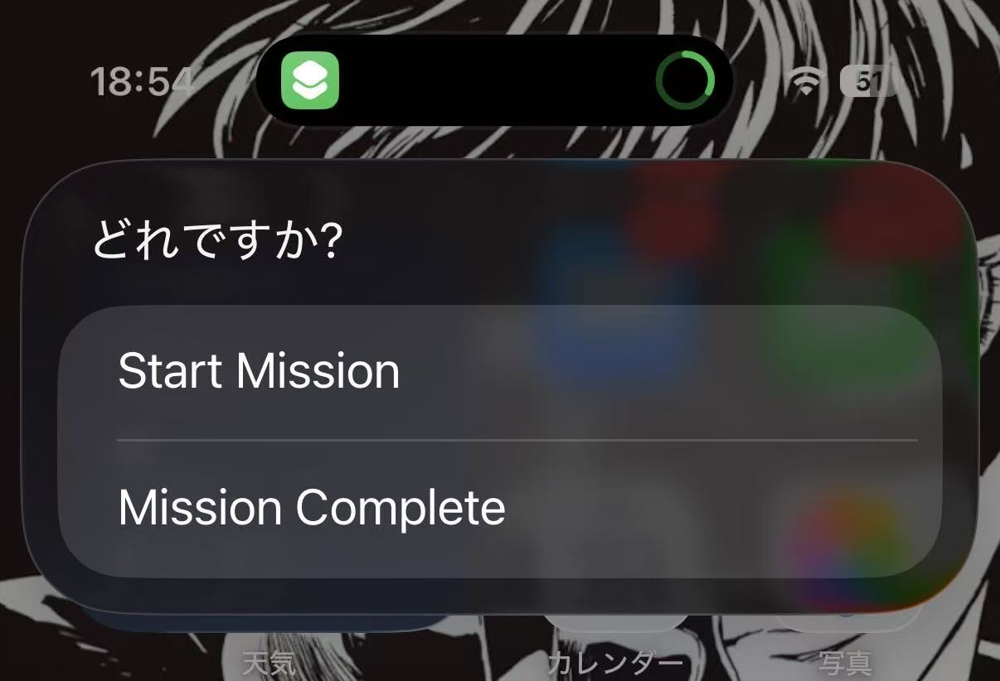
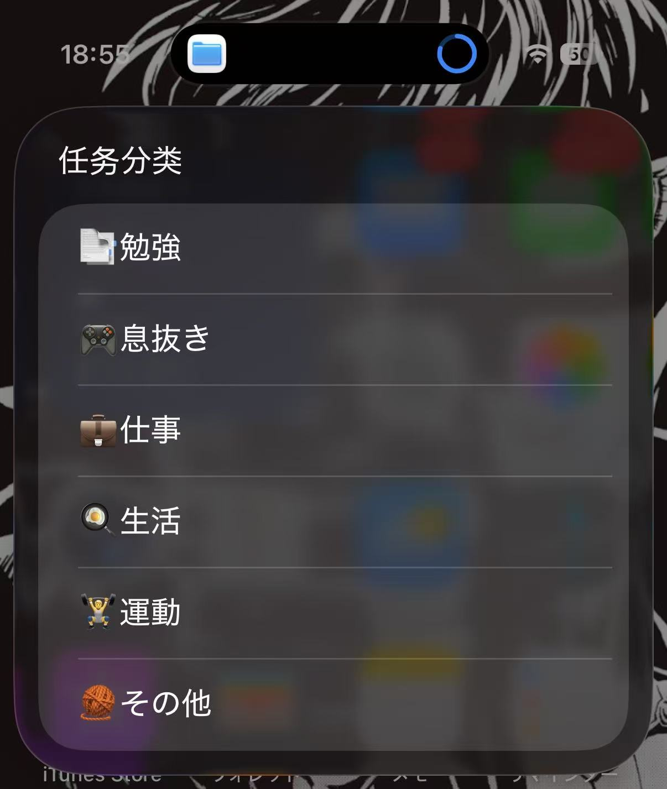
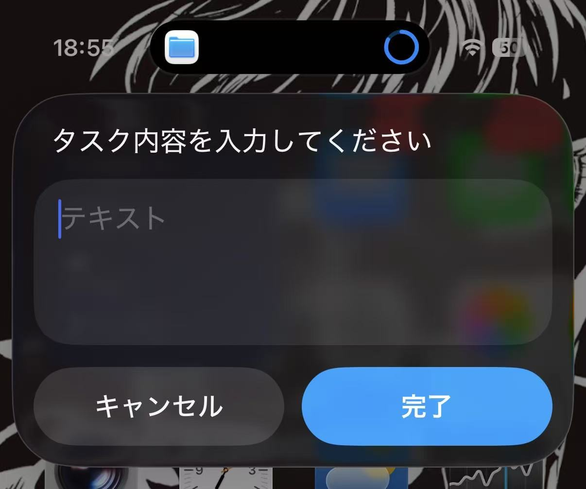
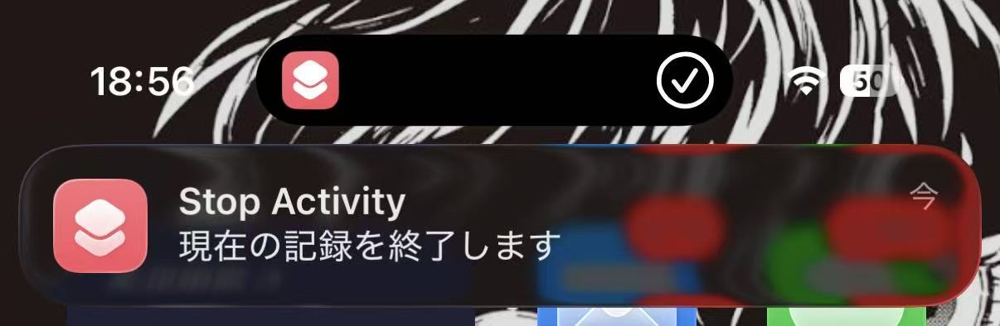
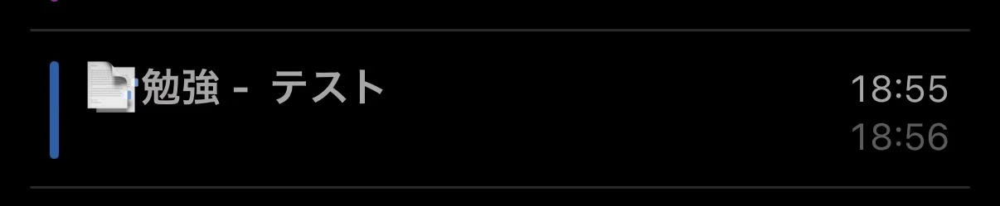

# iOS Shortcuts —  Task Tracker（タスク記録ショートカット）

Apple Calendar に「タスクカテゴリ + タスク内容（詳細）」を記録するための iOS ショートカット3点セットです。  
A lightweight iOS Shortcuts set to track what you’re doing and log it into Apple Calendar.

---

## 1) Overview（概要）

### 日本語
- **Start Activity**：カテゴリを選び、タスク内容を入力して記録を開始します  
- **Stop Activity**：進行中の記録を終了し、Apple カレンダーにイベントとして保存します  
- **Activity Menu**：Start / Stop をメニューで呼び出します（Action Button などに便利）

### English
- **Start Activity**: Choose a category, enter task details, and start tracking  
- **Stop Activity**: Stop the current task and save it as an Apple Calendar event  
- **Activity Menu**: A launcher menu for Start / Stop (ideal for Action Button / widgets)

---

## Changelog（更新履歴）

- **2026-01-20**: Fix time parsing bug where `2:14` could be interpreted as `14:14`. Start time is now saved in **ISO 8601** format to avoid ambiguity. **iCloud links have been regenerated and updated below.**

---

## 2) Shortcuts & iCloud Links（ショートカットとリンク）
> ✅ Latest iCloud links (updated on **2026-01-20**)
### Activity Menu（メニュー）
Start/Stop を選んで呼び出します。  
A menu shortcut that launches Start Activity or Stop Activity.

- https://www.icloud.com/shortcuts/06517c58fb5d42ad93dc7fd83b45a1a6

### Start Activity（開始）
カテゴリを選び、タスク内容を入力して開始します。  
Select a category, enter task details, and start tracking.

- https://www.icloud.com/shortcuts/135d557a3f064ea581a9ba372391f1b2

### Stop Activity（終了・保存）
進行中の記録を終了し、カテゴリとタスク内容を Apple カレンダーに保存します。  
Stops the task and writes category + details into Apple Calendar.

- https://www.icloud.com/shortcuts/21be602e8ce04fbcaae81bc9f4bd3216

---

## 3) Requirements（必要条件）

### 日本語
- iPhone / iPad（ショートカットApp）
- Apple カレンダーへのアクセス権限（必須）

### English
- iPhone / iPad with the Shortcuts app
- Calendar permission (required)

---

## 4) Default Configuration（デフォルト設定・重要）

> ⚠️ このショートカットは **カテゴリ名（List）** と **カテゴリ→保存先カレンダー（If）** が固定です。  
> ⚠️ These shortcuts use a **category List** and an **If mapping (Category → Calendar)**.

### 4.1 Categories（カテゴリ：Start Activity の List）
Start Activity の「Choose from List」で使用しているカテゴリは以下の5種類です。  
The category list in Start Activity is fixed to these 5 values:

- 勉強（Study）
- 仕事（Work）
- 娯楽（Entertainment）
- 運動（Exercise）
- その他（Other）

### 4.2 Calendar Names（カレンダー名：Stop Activity の If）
Stop Activity は `If / Otherwise If` でカテゴリごとに保存先カレンダーを選びます。  
Stop Activity selects the destination calendar via an `If / Otherwise If` chain.

Apple カレンダーに以下の名前のカレンダーが必要です（またはショートカット側を編集してください）。  
You must have calendars with these names (or edit the shortcuts to match yours):

- 勉強
- 仕事
- 娯楽
- 運動
- その他

---

## 5) One-Time Setup（初回セットアップ）

### 日本語
1. カレンダーAppを開く  
2. **5つのカレンダー**（勉強/仕事/娯楽/運動/その他）を作成（または既存をリネーム）  
3. Start Activity を一度実行して権限を許可  
4. Start → Stop を試し、イベントが正しいカレンダーに入るか確認

### English
1. Open the Calendar app  
2. Create (or rename) the **5 calendars**: 勉強 / 仕事 / 娯楽 / 運動 / その他  
3. Run Start Activity once and grant permissions  
4. Try Start → Stop and confirm the event is saved to the expected calendar

---

## 6) How to Use（使い方）

### Start a task（開始）
- 日本語：
  1) Activity Menu → Start Activity  
  2) カテゴリを選ぶ（勉強/仕事/娯楽/運動/その他）  
  3) タスク内容を入力  
  4) 記録開始

- English:
  1) Activity Menu → Start Activity  
  2) Select a category (勉強/仕事/娯楽/運動/その他)  
  3) Enter task details  
  4) Tracking starts

### Stop & save（終了して保存）
- 日本語：
  1) Activity Menu → Stop Activity  
  2) 記録を終了  
  3) Apple カレンダーにイベントとして保存

- English:
  1) Activity Menu → Stop Activity  
  2) Stop the current task  
  3) Save it as a Calendar event

---

## 7) UI Messages（表示メッセージ一覧）

### 日本語
本プロジェクトで使用している表示メッセージは以下の通りです（英語の意味も併記します）。
### English
This project uses the following Japanese UI messages (with English meanings).

#### 入力促し（Prompts）
- 「タスク内容を入力してください」  
  - EN: Please enter the task details.

#### 状態 / 注意（Status / Warnings）
- 「初めてのご利用ですね！最初のタスクを記録しましょう😆」  
  - EN: First time here! Let’s record your first task 😆
- 「現在の記録を終了します」  
  - EN: Ending the current record.
- 「実行中のタスクはありません」  
  - EN: There is no running task.

#### 入力チェック（Validation Error）
- 「タスクカテゴリが正しくありません！」  
  - EN: The task category is invalid!

---

## 8) Built-in Safeguards（例外処理 / 安全設計）

### 日本語
このショートカットには、状態が崩れないようにするためのガード（例外処理）があり、状況に応じて分かりやすいメッセージを表示します。

1) 初回利用（First-time use）
- 条件：`CurrentTask` ファイルが存在しない  
- 表示：「初めてのご利用ですね！最初のタスクを記録しましょう😆」

2) 進行中なしで Stop（Stop with no active task）
- 条件：実行中のタスクがない  
- 表示：「実行中のタスクはありません」

3) 記録中に Start を再実行（Start while another task is running）
- 条件：まだ終了していないタスクがある  
- 動作：現在の記録を終了してから、新しいタスクを開始する  
- 表示：「現在の記録を終了します」

### English
These shortcuts include safeguards (guardrails) to prevent invalid states and guide you with clear messages.

1) First-time use
- Condition: The `CurrentTask` file does not exist  
- Message: “初めてのご利用ですね！最初のタスクを記録しましょう😆”

2) Stop with no active task
- Condition: There is no running task  
- Message: “実行中のタスクはありません”

3) Start while another task is running
- Condition: A task is still running (not yet stopped)  
- Behavior: The shortcut terminates the current record, then starts a new task  
- Message: “現在の記録を終了します”

## 9) Troubleshooting（よくあるエラー）

### 「タスクカテゴリが正しくありません！」（Invalid category）
- 日本語：カテゴリが「勉強 / 仕事 / 娯楽 / 運動 / その他」の5種類以外になっています。  
- English: The selected category is not one of the 5 predefined categories:
  勉強 / 仕事 / 娯楽 / 運動 / その他

**Fix（対処）**
### 日本語
1. Start Activity のカテゴリリスト（Choose from List）が上記5種類になっているか確認  
2. Stop Activity の If 条件がカテゴリ名と完全一致しているか確認（文字列一致）

### English
1. Check that the category list in Start Activity (Choose from List) contains the five predefined categories.  
2. Check that the If conditions in Stop Activity exactly match the category names (exact string match).

---

## 10) Customization（カスタマイズ）

> ✅ 実装は「カテゴリは List」「保存先は If」。名前を変える場合は **両方を更新**してください。  
> ✅ Categories come from a List, calendars are chosen by If—update BOTH if you rename anything.

### A) Edit Categories（カテゴリ名：Start Activity）
- Start Activity を開く / Open Start Activity  
- Choose from List の項目を編集 / Edit the Choose from List items  
- 保存 / Save

### B) Edit Calendar Mapping（保存先：Stop Activity）
- Stop Activity を開く / Open Stop Activity  
- `If Category is "勉強" → Calendar = "勉強"` のような If 連鎖を編集  
  / Edit the `If / Otherwise If` chain mapping category → calendar  
- 保存 / Save

